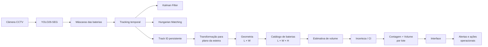
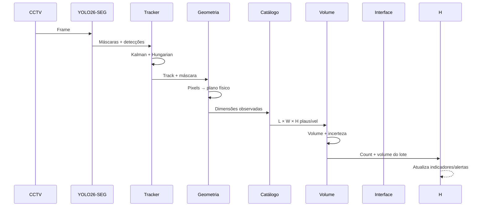

# Visão Computacional para Reciclagem de baterias

> 🏆 **Projeto vencedor do Hackathon Reply Brasil 2026 — Code for the Giants**

Sistema de visão computacional para **detecção, rastreamento e estimativa de volume de baterias em esteiras de reciclagem**, desenvolvido durante o **Hackathon Reply Brasil 2026**.

A solução transforma imagens de uma câmera de CFTV já presente na operação em informações úteis para o chão de fábrica: **quantas baterias passaram pela esteira, quais objetos já foram contabilizados, qual o volume estimado do lote e quão confiável é essa estimativa**.

<p align="center">
  <b>CCTV → Segmentação → Tracking → Geometria → Catálogo → Incerteza → Volume/Lote</b>
</p>

---

## 👨‍💻 O Hackaton

O projeto foi desenvolvido para a **Trilha C — Visão Computacional para Reciclagem** do Hackathon Reply Brasil 2026.

O desafio propunha uma esteira de triagem de uma recicladora monitorada por uma câmera fixa de CFTV em vista superior. Entre os materiais passam baterias — incluindo baterias de lítio — que representam risco operacional e precisam ser **identificadas e quantificadas automaticamente**.

A solução precisava:

* detectar e classificar os componentes;
* rastrear objetos ao longo do vídeo sem realizar contagem duplicada;
* estimar o volume acumulado de cada lote;
* processar os vídeos reais fornecidos pelo desafio;
* apresentar contagem e volume de forma legível;
* possuir uma demonstração funcional.

Como diferenciais, o desafio também valorizava uma **métrica própria de qualidade**, evidências de avaliação e uma **interface que pudesse ser utilizada por um operador industrial**.

**Resultado: nosso time conquistou o primeiro lugar no Hackathon. 🥇**

---

## 👥 Time

* Caio Henrique
* Felipe Damasceno
* Gabriel Gomes
* Isaac Reyes
* Marco Aurelio

---

## 🎯 O problema

Em uma linha de reciclagem, identificar manualmente baterias misturadas aos demais materiais é uma tarefa difícil.

O problema não se resume a detectar um objeto em uma imagem.

Para obter uma informação operacional realmente útil, é necessário responder várias perguntas consecutivas:

1. **Onde está a bateria?**
2. **Essa bateria já apareceu em um frame anterior?**
3. **Quais são suas dimensões reais?**
4. **Qual bateria do catálogo melhor corresponde a essas dimensões?**
5. **Quanto podemos confiar nessa estimativa?**
6. **Qual o volume acumulado do lote?**

Além disso, as condições de uma câmera industrial tornam o problema mais difícil:

* perspectiva e distorção da câmera;
* grande variação de tamanho entre baterias;
* oclusões e sobreposição de objetos;
* movimento contínuo da esteira;
* necessidade de evitar contagem dupla;
* compromisso entre **qualidade do modelo e velocidade de inferência**;
* perda de informação ao reduzir a resolução do vídeo.

Esses pontos foram alguns dos principais obstáculos encontrados durante o desenvolvimento.

---

## 💡 Nossa solução

Nós implementamos um pipeline completo de percepção sobre o vídeo da esteira.

Em vez de tratar cada frame isoladamente, a solução conecta **segmentação, tracking, geometria e conhecimento prévio sobre as baterias** para gerar uma estimativa final de volume.

A arquitetura conceitual desenvolvida durante o hackathon foi:

```text
CCTV
 │
 ▼
Segmentação
"Onde está a bateria?"
 │
 ▼
Tracking
"É a mesma bateria?"
 │
 ▼
Geometria
"Quanto ela mede?"
 │
 ▼
Catálogo
"Quais dimensões são plausíveis?"
 │
 ▼
Incerteza
"Quanto confiamos?"
 │
 ▼
Volume / Lote
```

Essa sequência — segmentação, tracking, geometria, catálogo, incerteza e volume — foi a arquitetura central apresentada pelo time.

---

## 🏗️ Arquitetura



Na implementação demonstrada no hackathon, o pipeline combina **YOLO26-SEG**, filtragem de **Kalman** e associação pelo algoritmo **Hungarian**, seguido pela transformação da máscara para o plano físico da esteira e comparação com um catálogo dimensional. A Interface apresentada mostra esse pipeline operando sobre um vídeo da esteira.

---

### 1. Segmentação

O primeiro estágio responde:

> **Onde está a bateria?**

Utilizamos um modelo de **segmentação de instâncias**, permitindo obter não apenas uma bounding box, mas a **máscara correspondente ao formato visível de cada bateria**.

```text
Frame
  │
  ▼
YOLO26-SEG
  │
  ├── Battery #1 mask
  ├── Battery #2 mask
  ├── Battery #3 mask
  └── ...
```

As máscaras são particularmente importantes porque a etapa seguinte precisa estimar propriedades geométricas dos objetos.

---

### 2. Tracking

Detectar a mesma bateria em 30 frames diferentes **não pode resultar em 30 baterias contabilizadas**.

Por isso, as detecções são associadas temporalmente.

O pipeline demonstrado utiliza:

* **Kalman Filter** para previsão temporal do estado dos objetos;
* **Hungarian Algorithm** para associação entre detecções e tracks;
* IDs persistentes para acompanhar cada bateria ao longo da esteira.

```text
Frame t                         Frame t+1

Battery                         Battery
Track #42  ───────────────────► Track #42

Battery                         Battery
Track #43  ───────────────────► Track #43
```

Isso permite estabelecer um **count gate**: uma região da esteira na qual cada track confirmado é contabilizado apenas uma vez.

---

### 3. Geometria

A câmera observa uma superfície tridimensional através de uma imagem em perspectiva.

Logo, simplesmente medir uma máscara em pixels não fornece diretamente o tamanho real da bateria.

O pipeline transforma a posição e a geometria observadas na imagem para um **plano físico calibrado da esteira**.

Na demonstração, a região de referência utilizada foi aproximadamente:

```text
5900 mm × 1500 mm
```

O fluxo passa então de:

```text
máscara em pixels
       ↓
plano da esteira em milímetros
       ↓
estimativa geométrica da bateria
```

Essa etapa permite deixar de trabalhar somente com pixels e passar a raciocinar em dimensões físicas.

---

### 4. Catálogo dimensional

Somente a visão monocular da câmera não permite determinar perfeitamente todas as dimensões tridimensionais de uma bateria.

A solução utiliza então um **catálogo conhecido de dimensões de baterias**.

A geometria observada é confrontada com combinações plausíveis de:

```text
L × W × H
```

Assim, conhecimento prévio sobre os componentes complementa a percepção visual:

```text
Geometria observada
        │
        ▼
┌──────────────────────┐
│ Catálogo de baterias │
│                      │
│ L × W × H            │
└──────────────────────┘
        │
        ▼
Dimensões plausíveis
```

A própria especificação do desafio forneceu uma tabela de medidas de baterias e as dimensões da bandeja como insumos para o desenvolvimento.

---

### 5. Estimativa de volume

Após a associação com dimensões plausíveis do catálogo, o sistema consegue estimar o volume de cada objeto e ir acumulando os dados durante a passagem do lote:

```text
Battery #42 ──► V₁
Battery #43 ──► V₂
Battery #44 ──► V₃
                 │
                 ▼
        Volume do lote
        V = V₁ + V₂ + V₃ + ...
```

O objetivo final deixa de ser simplesmente **"detectar baterias"** e passa a ser produzir uma informação diretamente utilizável pela operação:

> **quantidade de baterias + volume acumulado do lote.**

---

### 6. Incerteza

Uma estimativa visual nunca é perfeita.

Perspectiva, oclusão, resolução, segmentação incompleta e diferenças entre os modelos reais de bateria introduzem incerteza.

Por isso, a arquitetura possui explicitamente uma etapa de:

> **"Quanto confiamos?"**

A confiança das observações acompanha a estimativa de volume, evitando apresentar uma medição visual como se fosse uma medida física exata.

---

## 🖥️ Interface

Além do pipeline de visão computacional, desenvolvemos uma Interface voltada para um cenário industrial.

A interface permite visualizar o vídeo processado junto aos principais indicadores da operação, incluindo:

* objetos e tracks detectados;
* região válida da esteira;
* count gate;
* quantidade contabilizada;
* volume acumulado do lote;
* quantidade de tracks confirmados;
* confiança das máscaras;
* status do modelo;
* eventos recentes;
* estado da esteira;
* alertas;
* reset de lote.

Também foi construída uma camada de **simulação de PLC/intertravamento**, utilizada apenas para demonstrar como a saída do sistema poderia participar de uma operação industrial.

A integração com PLC, atuadores ou hardware real da planta estava explicitamente fora do escopo do desafio e foi feita apenas para fins de demonstração.

  


A interface foi um dos componentes utilizados na demonstração funcional apresentada durante o hackathon.

---

## 📊 Avaliação

Durante o desenvolvimento, avaliamos o impacto da resolução sobre o modelo de segmentação.

| Métrica          | 1080p |  720p | Diferença |
| ---------------- | ----: | ----: | --------: |
| **Mask AP50**    | 0.254 | 0.242 |     0.012 |
| **Mask AP50-95** | 0.128 | 0.127 |     0.001 |
| **Mask Recall**  | 0.424 | 0.343 |     0.081 |

O resultado mostra um trade-off interessante.

A redução para 720p teve pouco impacto sobre AP50-95, mas causou uma queda significativamente maior no **recall das máscaras**.

Isso é particularmente relevante neste problema: em uma esteira industrial, um objeto não detectado pode significar uma bateria não contabilizada.

Portanto, escolher a resolução de inferência não é apenas uma otimização de performance — é uma decisão diretamente ligada à confiabilidade operacional do sistema.

---

## ⚙️ Pipeline resumido



---

## 🧠 Principais decisões de engenharia

### Segmentação em vez de apenas detecção

Bounding boxes são suficientes para localizar objetos, mas fornecem informação geométrica limitada.

Máscaras permitem utilizar melhor o formato visível da bateria na estimativa geométrica.

### Tracking antes da contagem

A contagem é baseada em **identidades persistentes**, e não em número de detecções por frame.

Isso reduz drasticamente o problema de dupla contagem.

### Conhecimento físico + visão computacional

Em vez de tentar recuperar toda a geometria 3D diretamente de uma única câmera, utilizamos:

```text
informação visual
      +
geometria da esteira
      +
catálogo conhecido
```

Essa abordagem permite transformar um problema visual subdeterminado em uma estimativa fisicamente plausível.

### Incerteza como parte da saída

O sistema não trata todas as estimativas como igualmente confiáveis.

A incerteza faz parte da própria arquitetura, tornando a saída mais adequada para uma aplicação industrial.

### Interface orientada ao operador

O objetivo não era apenas produzir um notebook ou um vídeo com bounding boxes.

A solução foi apresentada através de uma Interface que transforma as saídas do modelo em indicadores operacionais compreensíveis.

---

## 🚧 Principais desafios encontrados

Durante o hackathon, quatro problemas se destacaram:

### Resolução

Reduzir a resolução aumenta a velocidade de processamento, mas também pode fazer objetos menores desaparecerem ou degradar as máscaras.

### Distorção da câmera

Uma câmera em perspectiva altera a relação entre pixels e dimensões reais dependendo da posição do objeto.

### Variação das baterias

Baterias possuem formatos e dimensões diferentes, dificultando a estimativa de volume a partir apenas da aparência visual.

### Qualidade × velocidade

Modelos maiores podem produzir melhores máscaras, mas uma aplicação sobre uma esteira exige baixa latência.

Encontrar um ponto de equilíbrio entre **qualidade da percepção e velocidade de inferência** foi uma das principais decisões do projeto.

---

## 🚀 Como executar

O projeto utiliza o **[uv](https://docs.astral.sh/uv/)** para gerenciamento do ambiente virtual e das dependências Python.

### 1. Clone o repositório

```bash
git clone https://github.com/DataCaio/Hackathon-reply.git
cd Hackathon-reply
```

---

### 2. Instale o `uv`

Caso ainda não tenha o `uv` instalado, siga as instruções de instalação da [documentação oficial](https://docs.astral.sh/uv/getting-started/installation/).

Você pode verificar a instalação com:

```bash
uv --version
```

---

### 3. Instale as dependências

Na raiz do projeto, execute:

```bash
uv sync
```

O `uv` criará automaticamente o ambiente virtual em `.venv` e instalará as dependências definidas pelo projeto, respeitando as versões registradas no `uv.lock`.

Não é necessário criar ou ativar manualmente um `venv`.

Para executar comandos dentro do ambiente do projeto, utilize:

```bash
uv run <comando>
```

Por exemplo:

```bash
uv run python main.py
```

> Para execução e treinamento dos modelos de visão computacional, uma **GPU NVIDIA com suporte a CUDA** é recomendada.


### 4. Prepare os dados

O sistema foi desenvolvido utilizando os vídeos de CFTV fornecidos no desafio.

Configure no projeto:

* caminho para o vídeo;
* pesos do modelo treinado;
* parâmetros de calibração;
* dimensões da região física da esteira;
* catálogo dimensional das baterias.

Exemplo conceitual:

```text
input/
├── videos/
│   └── esteira.mp4
├── models/
│   └── segmentation.pt
└── catalog/
    └── batteries.csv
```

> Os vídeos utilizados oficialmente no hackathon podem não estar versionados no repositório devido ao tamanho e às condições de distribuição do desafio.

---

### 5. Execute o pipeline

Execute o entrypoint correspondente ao pipeline de processamento disponível no repositório.

O fluxo esperado é:

```text
carregar vídeo
    ↓
executar segmentação
    ↓
atualizar tracks
    ↓
projetar geometria
    ↓
consultar catálogo
    ↓
estimar volume
    ↓
agregar lote
    ↓
atualizar Interface
```

Os caminhos do vídeo, modelo e arquivos de calibração devem apontar para os respectivos arquivos locais utilizados na execução.

---

## 📥 Entradas

O desafio disponibilizou:

* clipes de CFTV da esteira em operação;
* tabela de medidas das baterias;
* medidas da bandeja;
* servidor Linux com GPU dedicada para treinamento.

---

## 📤 Saídas

A solução produz informações como:

```text
Track ID
Classe / tipo de bateria
Máscara
Confiança
Dimensões estimadas
Volume estimado
Estado do track
Evento de contagem
Volume acumulado do lote
```

Na camada de operação, essas informações são consolidadas em:

```text
COUNT        → quantidade de componentes contabilizados
LOT VOLUME   → volume acumulado
TRACKS       → objetos acompanhados pelo sistema
CONFIDENCE   → confiança da percepção
STATUS       → estado operacional
EVENTS       → histórico recente
```

---

## 🔬 Limitações

Este projeto foi desenvolvido em um ambiente de **hackathon de um único dia**, portanto algumas decisões foram propositalmente priorizadas para permitir uma demonstração ponta a ponta.

Entre as limitações estudadas estão:

* calibração de câmera ainda passível de refinamento;
* sensibilidade à resolução;
* objetos parcialmente ocluídos;
* diferenças entre dimensões reais e as disponíveis no catálogo;
* estimação monocular de volume;
* compromisso entre precisão e throughput;
* necessidade de maior quantidade de dados de treinamento.

A integração apresentada com PLC é uma **simulação**. O próprio desafio definiu integração com hardware industrial como fora do escopo.

---

## 🔭 Próximos passos

Uma evolução natural do projeto incluiria:

* calibração intrínseca e extrínseca mais precisa da câmera;
* maior dataset de baterias e situações de oclusão;
* otimização do modelo para inferência em edge;
* quantização e aceleração do modelo;
* refinamento do tracking em grandes oclusões;
* estimativas probabilísticas de volume mais robustas;
* catálogo industrial ampliado;
* telemetria e histórico de lotes;
* integração real com sistemas supervisórios;
* integração validada com PLC e dispositivos de segurança;
* múltiplas câmeras para reduzir ambiguidades geométricas.

---

## 🥇 Resultado

Tudo foi desenvolvido durante o Hackathon Reply Brasil 2026 e conquistou o **1º lugar da competição**.

O projeto nasceu da combinação de visão computacional, tracking, geometria e uma interface pensada para transformar resultados de modelos em **informação operacional utilizável em um ambiente industrial**.

---

<p align="center">
  <b>Feito em um dia. Feito para resolver um problema real da indústria.</b>
</p>
